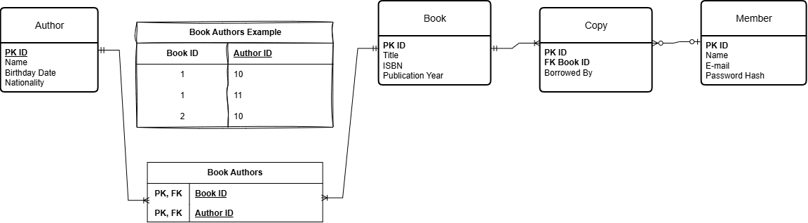

# LibrarySystem
LibrarySystem is a SQL project that represents a database system of a fictional library. The main idea is to utilize major key concepts of database modeling while creating a database. I plan to use MySQL as the SQL system.

## Technologies
Mainly only SQL and MySQL
I am also using draw.io to create the diagram

## Schema

The main idea is that a member can borrow 0 or many copies of books, but a copy can only be lended to 0 or 1 member. A copy only references one book, but a book can have 1 or many copies. A book can have many authors, and an author can have many books, but an author can only be one author of a book. The associative table is responsable for the link between the author and books.